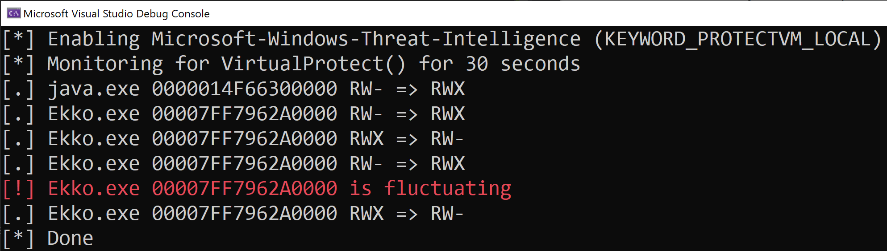

## Detection of hidden shellcode via immutable code page principle violations

It is security best practice that, once a page is marked executable, it should be immutable. 
That is, the the memory protection progression for code pages should only be RW to RX.

On Windows, [Kernel Patch Protection](https://en.wikipedia.org/wiki/Kernel_Patch_Protection) (aka PatchGuard) enforces this for the kernel and [Arbitrary Code Guard](https://blogs.windows.com/msedgedev/2017/02/23/mitigating-arbitrary-native-code-execution/) for user-mode images (where compatible and enabled).

There is no equivalent protection for private user-mode executbale code such as JIT.  However, JIT compilers, just like AOT compilers, only compile once.

We can monitor for violations of this principle using [Threat-Intelligence PROTECTVM_LOCAL](https://github.com/jdu2600/Windows10EtwEvents/blob/master/manifest/Microsoft-Windows-Threat-Intelligence.tsv) ETW events.

Therefore it is interesting whenever executable memory is changed to non-executable and, to be thorough, also when executable memory changes from non-writable to writable.

We could alert immediately on this but, like always, there are some false positives that we need to deal with. 
Some JIT engines re-use memory allocations and there is also legimate API hooking to account for.

The key difference between the benign and malicious behaviours is frequency.
To drastically reduces the false positive rate, we only alert if this is done *more than once*.

See [[Black Hat Asia 2023] You Can Run, but You Can't Hide - Finding the Footprints of Hidden Shellcode](https://www.blackhat.com/asia-23/briefings/schedule/index.html#you-can-run-but-you-cant-hide---finding-the-footprints-of-hidden-shellcode-31237) for more details.